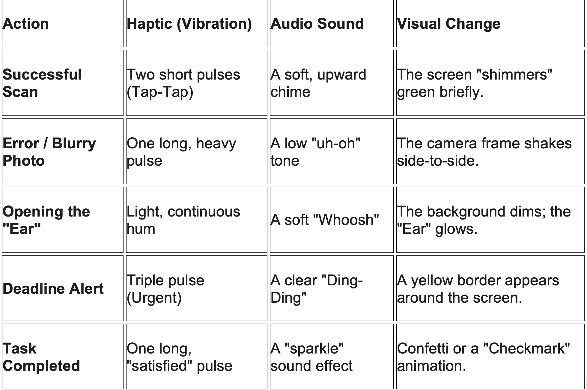

# 🔊 Behavioral Feedback Map (/ux-design/feedback_logic.md)

This document defines how the app "talks back" to the user physically and audibly to build a sense of safety and control.

# 🧩 The "Visual Anchor" Legend

Since the user may not read the word "Health" or "Legal," we need a Symbol Standard. Add this to your design folder so the icons stay consistent across the app:
	•	🏥 (The Clinic): Always Red/White. Used for vaccines, doctor appointments, and meds.
	•	🏫 (The School): Always Yellow/Black (like a bus). Used for enrollment, grades, and meetings.
	•	⚖️ (The Scale): Always Blue/Gold. Used for Court, ICE check-ins, and lawyer papers.
	•	🏠 (The Home): Always Green. Used for rent, light bills, and housing inspections.

# 📲 The "Low-Data" Mode UI

Many families you work with might be on "Pay-as-you-go" data plans or have a weak signal.
	•	Feature: A "Gray Scale" mode or "Text-Only" (read aloud) mode that uses almost zero data.
	•	Logic: If the signal is weak, the app stops trying to show high-def icons and just shows big, solid-colored blocks that are easier to load.

