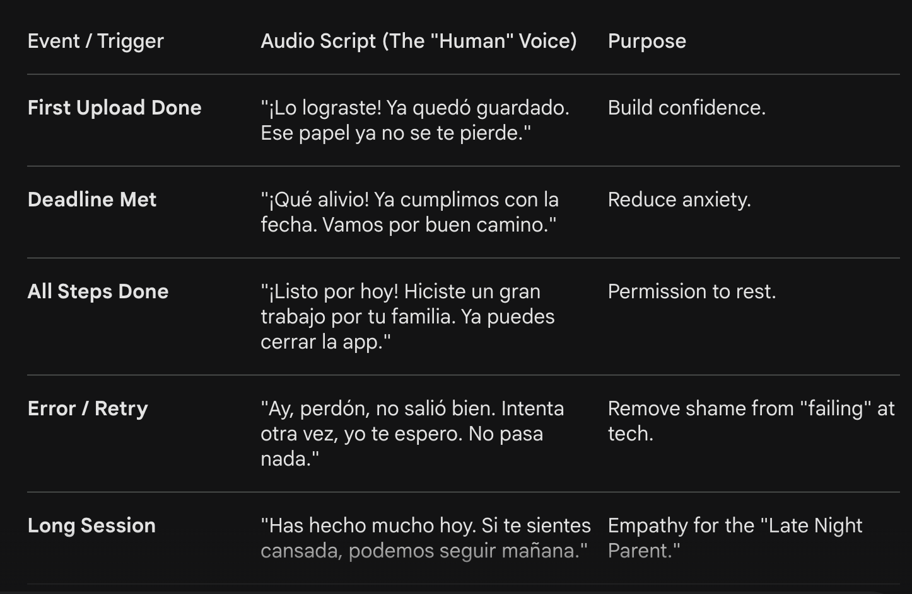

# 🎨 UI/UX Design Brief: ClaroPaso (The "Zero-Literacy" Framework)

## 1. The "First-Launch" Overlay
When the user opens the app for the first time, the background is dimmed (70% opacity) to highlight the Action Zones.
	•	The Anchor (Camera): A large, circular, pulsing button in the bottom center.
	◦	Visual Cue: A hand-drawn style Yellow Arrow points directly at it.
	◦	The Bubble: A soft-edged speech bubble above the arrow says: "Toca aquí para ver tus papeles" (with a camera icon inside the bubble).
	•	The Audio Trigger (The Ear): In the top-right corner, a friendly "Ear" icon pulses.
	◦	Logic: If the user doesn't touch anything for 3 seconds, a voice says: "Hola, soy tu guía. Toca el círculo grande de abajo para tomarle una foto a tu papel."

## 2. The Main Dashboard (Post-Onboarding)
Once the "First-Launch" ends, the interface should feel like a Table of Contents for their life.

## 3. The "Foto-Resumen" (Document Results) Screen
After the user takes a photo of a document, the screen changes to show Clarity.
	•	The Summary Box: Instead of showing the full scanned document text (which is overwhelming), the top half of the screen shows a Big Icon representing the document type (e.g., a School Bus for an enrollment form).
	•	The "Hablame" Bar: A prominent "Play" bar at the bottom.
	◦	Visual: As the AI reads the summary, a wave-form animation moves to show progress.
	•	The "Next Step" Button: One single, high-contrast Green Button at the bottom that says: "Guardar y avisarme" (Save and remind me).

## 4. Technical Specs for the Designer:
	•	Typography: Use Lexend or Readex Pro. These fonts are specifically designed to be legible for people with reading difficulties or dyslexia.
	•	Color Palette: Use "Safety Colors"—Green for "Done/Go," Yellow for "Pending/Look," and Blue for "Information." Avoid Red unless it is a life-critical emergency (911).
	•	Haptics: Every button tap should provide a "haptic thud" (vibration) so the user feels the interaction even if they can't hear it well.
