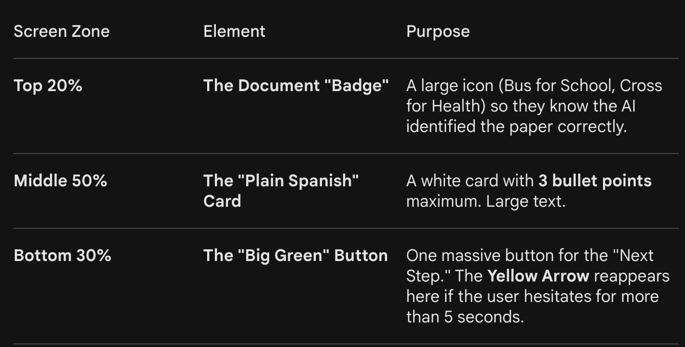

"Gioded Path" the UI needs.

# 🎨 Detailed Visual Mockup: The "ClaroPaso" Guided Experience

# 1. The Onboarding Overlay (First-Launch Only)
The "Dim & Highlight" Technique:

The Background: The entire screen is dimmed to 60% black.

The "Hole" (The Portal): A clear, bright circular cutout appears over the Camera Button at the bottom center.

The Arrow: A thick, #FFD700 (Sun Yellow) hand-drawn style arrow (curved, not a rigid straight line) points from the center of the screen down to the camera.

The Bubble: A soft-edged white bubble sits at the base of the arrow.

Text (Large Font): "Toca aquí para ver tus papeles."

Icon: A small 📸 icon next to the text.

The Audio Trigger: As soon as this screen appears, the "Onboarding Success" script plays automatically.

# 2. The "Persistent Ear" (The Safety Net)
Placement & Behavior:

Location: Top-Right Corner (The "Safe Zone").

Visual: A friendly, simplified ear icon 👂 (or a stylized "Sound Wave" circle).

The Pulse: It should have a subtle, constant "breathing" animation (scaling up and down by 5%) so the user knows it is "alive" and listening.

The Connection: A thin, dotted yellow line should occasionally "blink" between the Ear and whatever action is required next (like the "Save" button), like a quiet hint.

# 📐 The "Action Screen" Layout (Post-Scan)
Once the paper is scanned, the UI needs to be a "Guided Path."

